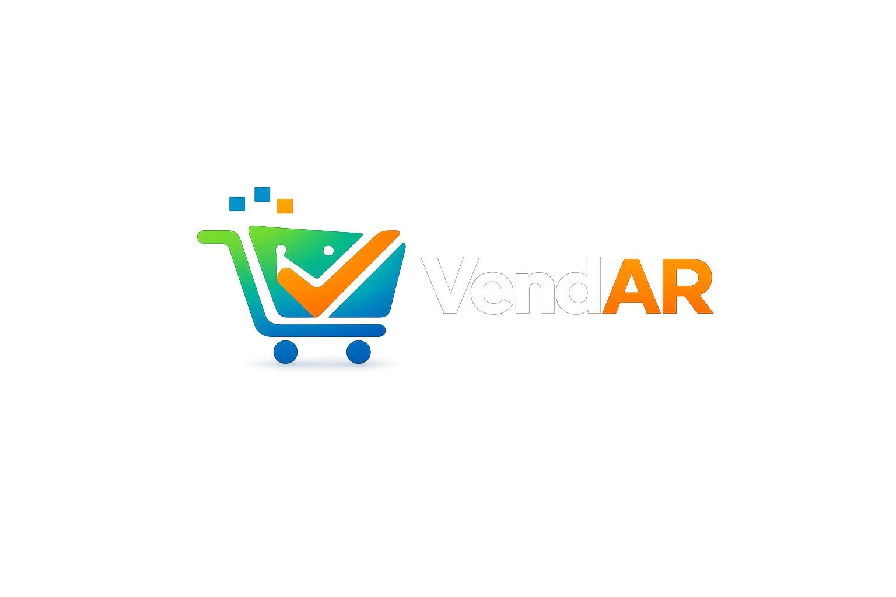

# VendAR — Sistema de Gestión para Kioscos y Minimercados

**VendAR** es un sistema SaaS de gestión y punto de venta (POS) diseñado para kioscos, minimercados, almacenes y cadenas comerciales chicas y medianas. Funciona completamente en el navegador — no necesitás instalar nada, solo una PC, tablet o celular con internet.

---

## ¿Para quién es?

| Si sos... | VendAR te sirve para... |
|-----------|------------------------|
| **Dueño de comercio** | Ver las ventas de todas tus sucursales en tiempo real desde el celular, controlar el stock sin ir al local, y saber si estás ganando o perdiendo plata. |
| **Cajero** | Cobrar rápido con lector de barras, hacer tickets, y cerrar la caja sin descuadrar. |
| **Encargado** | Gestionar el stock, hacer pedidos a proveedores, controlar lotes y vencimientos, y administrar las cuentas corrientes de los clientes. |

---

## Funcionalidades principales

- **Punto de Venta (POS)** — Cobro ágil con lector de código de barras, tickets profesionales, cierre de caja diario automático.
- **Control de stock** — Gestión por sucursal, alertas de stock mínimo, control de lotes y fechas de vencimiento.
- **Cuentas corrientes (fiados)** — Registro de deudas, pagos parciales, historial de movimientos por cliente.
- **Pedidos web** — Catálogo online público. Los clientes ven precios reales y hacen pedidos por WhatsApp.
- **Compras y proveedores** — Órdenes de compra, ingresos de stock, reposición automática.
- **Múltiples sucursales** — Centralizá la gestión de todos tus locales desde una misma cuenta.
- **Dashboard y reportes** — Métricas de ventas, productos más vendidos, evolución diaria.
- **Multi-tenant (SaaS)** — Cada comercio opera con sus datos aislados. Un solo sistema, múltiples clientes.

---

## Beneficios clave

- **Sin inversión en hardware** — Funciona en cualquier navegador. Podés usar una PC vieja, una tablet o tu celular.
- **Datos en la nube** — Backups automáticos diarios. No perdés ventas ni stock aunque se rompa la computadora.
- **Sin contratos largos** — Pagás por mes y cancelás cuando quieras. Sin permanencia.
- **Soporte humano** — Asistencia por WhatsApp y conexión remota. También coordinamos visitas presenciales si hace falta.

---

## Stack tecnológico

Laravel 11 · Vue 3 · Inertia.js · PostgreSQL · Tailwind CSS · Spatie Roles & Permissions

---

## Estado del proyecto

Actualmente en **desarrollo activo**. Próximamente:

- Facturación electrónica
- Integración con Mercado Pago (cobro automático de suscripciones)

---

## Contacto

[Agregá acá tu mail, WhatsApp, Instagram o el canal que uses para recibir clientes]
